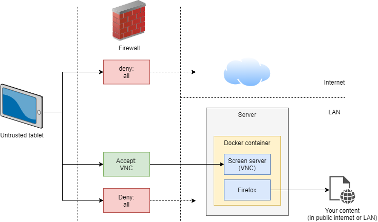
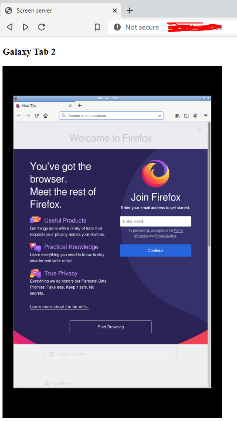
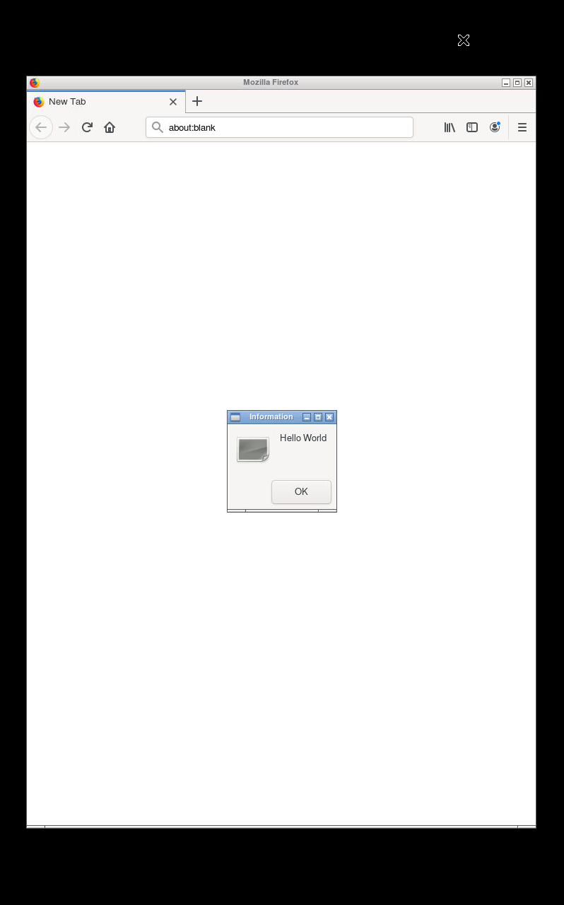

⬆️ For table of contents, click the above icon


[](https://hub.docker.com/r/fn61/screen-server/)

Minimal VNC-servable desktop environment with Firefox in a Docker container, for displaying web
content on untrusted devices (like an old Android tablet).

Nice added benefit is that you can connect to the same screen simultaneously from other
devices like PCs as well, and if scripting is needed (show content X on screen Y), it's
easier to achieve things like this on a PC than on a tablet.




Why?
----

I had old Android tablets lying around. They are untrusted, because they are dangerous,
because they haven't received software updates. I wanted to use one of them as always-on
info screen.

Because they're untrusted, I:

- taped off the camera & mic
- put it in a guest Wifi network (with no access to my LAN)
- configured firewall to not let the tablet in the internet, but only access to VNC port
  in my LAN


Which VNC app for Android
-------------------------

There's plenty to choose from, but they're not all equal. I've had success with bVNC.

(Pro-tip: one of my tablets was so old (Android 4.2) that it didn't even support
[RealVNC's current Android package](https://play.google.com/store/apps/details?id=com.realvnc.viewer.android).
I downloaded an old version via apkpure.com, and firewalled the tablet off before beginning
the installation.)


What's special about this image
-------------------------------

- Supports multiple screens (ran as separate users) with different resolutions
- OSD notifications, OSD API for sending messages to screens over the network
- Web UI w/ screen previews
- Image size is small (for an image with a desktop environment and a web browser)


How to run
----------

```console
$ docker run -d \
	--name screen-server \
	-p 5900:5900 \
	-p 80:80 \
	--shm-size 512m \
	-e "SCREEN_1=5900,800,1280,Galaxy Tab 2" \
	fn61/screen-server:TAG
```

> [!NOTE]  
> if you get openbox error or error launching Firefox check the troubleshooting section in this README.

Port 80 is for the web interface, port 5900 is for the example screen's VNC.

The format for the `SCREEN_n` parameter is `<VNC port>,<display width>,<height>,<screen name>,[<input device>]`

Why screen name? It's good if you have many screens. Web UI & some VNC clients show it.

You can optionally add **physical input devices** like a keyboard-mouse to a screen. There's a
separate README section for it.

If you have more than one screen, just add `SCREEN_2` and so on..

NOTE: `--shm-size` is important - with too small value Firefox & Chromium crash with more
websites (or >= 1 tab).


Note about state
----------------

Users should assume all state gets wiped daily. It doesn't, but we have absolutely no plans
to support migrating state (like Firefox configuration or installed plugins) when new
versions of this image gets released. When you spin up a new container with the new version,
all state gets lost.


Web UI
------

It shows you the preview of what's on all the screens.



You can click on the preview to launch [web-based VNC](https://github.com/novnc/noVNC) session.

Firefox users should read [this pro-tip](https://stackoverflow.com/a/12042843).


Map keyboard/mouse inside the container
---------------------------------------

TODO: improve these instructions

See [accompanying blog post](https://joonas.fi/2020/12/attach-a-keyboard-to-a-docker-container/)

You need to add the `evdev` device file to Docker run `--device` argument. The blog post explains more.

### Troubleshooting

If you run into problems, `$ cat` the input device from inside the container to test it works.
The blog post also explains this.


Sending OSD notifications
-------------------------

My use case was to display messages sent by my home automation in the screen that is always
visible.

```console
$ curl -d "msg=Hello world" http://localhost/api/screen/1/osd/notify
```

The notification is visible for a few seconds.

We have plugin drivers for different OSD notification implementations -  currently we use
[zenity](https://en.wikipedia.org/wiki/Zenity), which is not pretty. A prettier way could
be to show the notification as a full-screen webpage (so we get CSS animations etc.), but
that's still TODO.




Roadmap
-------

- Use standard `$ notify-send` and its DBUS protocol for OSD-notifications. Pick a nice front-end.
- Instead of supporting multiple screens (and users) inside container, just spin up a container per
  screen? Better for failure isolation, and you don't have to take all screens down if you want to
  reconfigure (think: map keyboard) one. Virtual memory etc. should make this not use more memory..
- Integrate screen-server-client (audio playing extensions, screen on/off API) into this repo
- Go back to Alpine Linux. It shaved off a large amount of disk space, but Widevine (= DRM) didn't
  work in Alpine's Firefox (due to glibc incompatibility I think), and thus I couldn't get Spotify
  web player to work.

Troubleshooting
---------------

### openbox error or error launching Firefox

you may need to add [`--security-opt` arg](https://github.com/function61/screen-server/issues/8#issuecomment-2058301288)


Credits
-------

I learned how to plug Xvfb, x11vnc, Openbox together from
[danielguerra69/alpine-vnc](https://github.com/danielguerra69/alpine-vnc). I added Firefox,
process management in Go (instead of Python), multi-screen support, OSD etc.


Links
-----

- Similar but for Wayland: [bbusse/swayvnc-firefox](https://github.com/bbusse/swayvnc-firefox)
